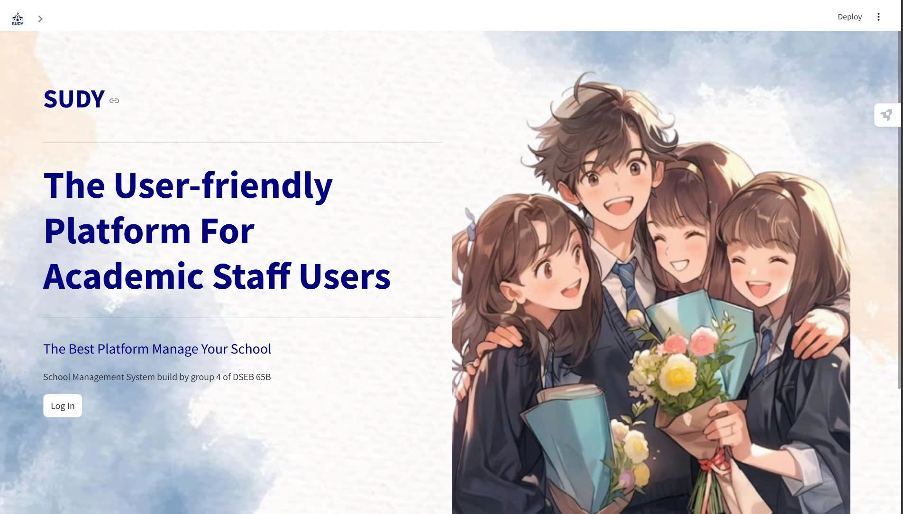
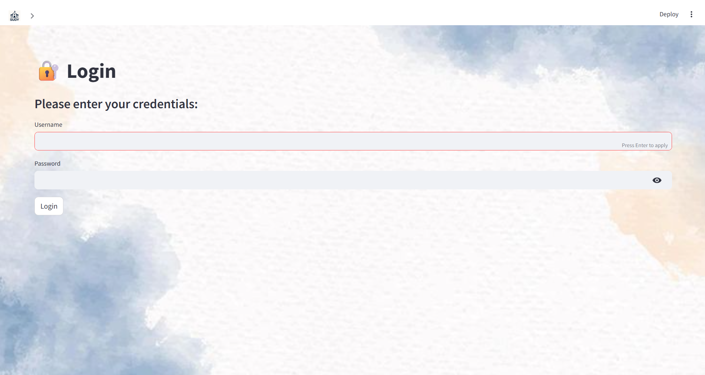
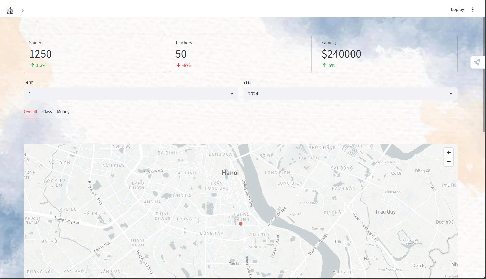
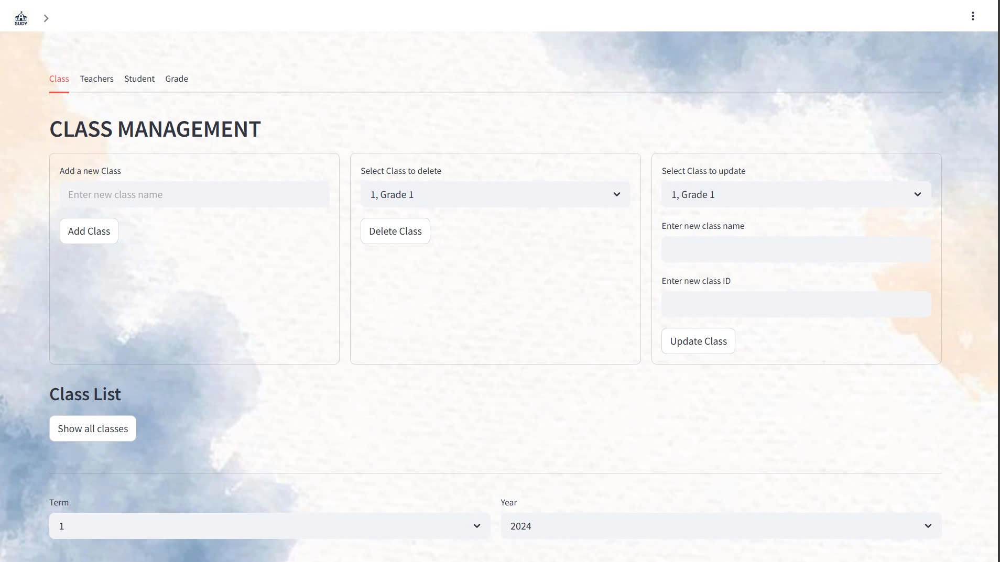

# DBMS_School_Management_

**Group members**

1. 11230571: Nguyen Thanh Mo
2. 11230593: Duong Thi Huyen Trang
3. 11230573: Dang Ngoc Hoa
4. 11230547: Le Lan Huong

The platform has 4 main pages:

**Home page:** 

**Log in page:** 

The user can log in every account created in SQL., for full access to the data, we log in in admin user

**Dashboard page:** 

For reporting the data of School and classes

**Management page:**

For manage the information of Classes, Students, Teachers and Grades

**Backup & Recovery:**

Triggers to record activity of each tables are in school_management.sql, we build a python file named backup_school_management.py to save the backup file in D- disk.

